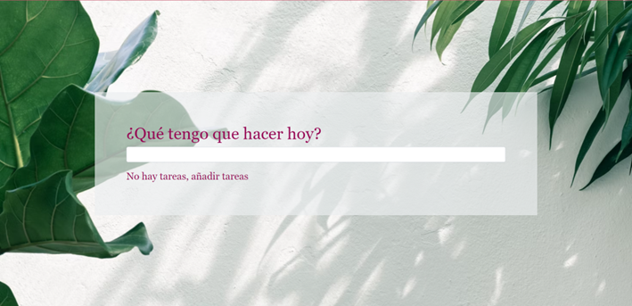
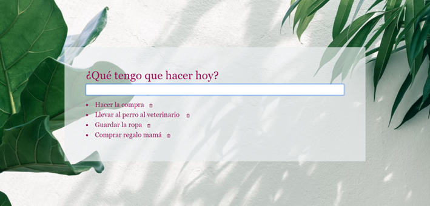

# What To Do Today?

Con What To Do Today podrás gestionar las tareas del día.





## Instala el paquete npm

```
$ npm install
```

## ¡Empieza a programar!

For Windows, Mac, Linux or Gitpod, start the webpack server with live reload:
- `$ npm run start`
<p>
  <a href="https://gitpod.io#https://github.com/4GeeksAcademy/react-hello.git">
  </a>
</p>
Esta plantilla es similar a create-react-app pero está pensada para los estudiantes de la Academia 4Geeks.

## 📝 Instrucciones

- Las tareas se agregan cuando el usuario presiona enter en el teclado.
- El icono de eliminar solo se muestra cuando la tarea está activada.
- El usuario puede agregar tantas tareas como desee.
- Cuando no hayan tareas pendientes la lista debería decir "No hay tareas, añadir tareas"
- No hay forma de actualizar una tarea, el usuario tendrá que eliminarla y crearla de nuevo.

## ✨ Sobre el Proyecto

La aplicación cumple con todos los requisitos del ejercicio. Además he aprovechado para prácticar el diseño responsivo y el despliegue de la aplicación en Vercel.


Puedes probar cómo funciona aquí:

https://what-to-do-today-xi.vercel.app/
